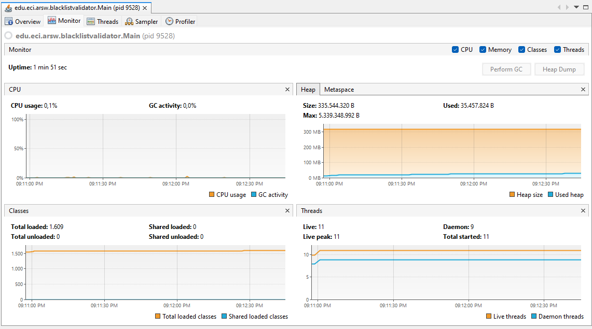
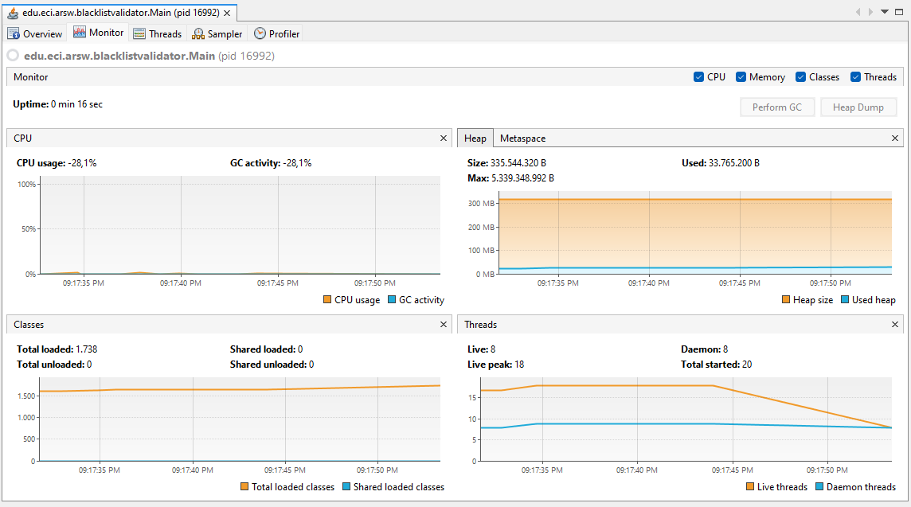
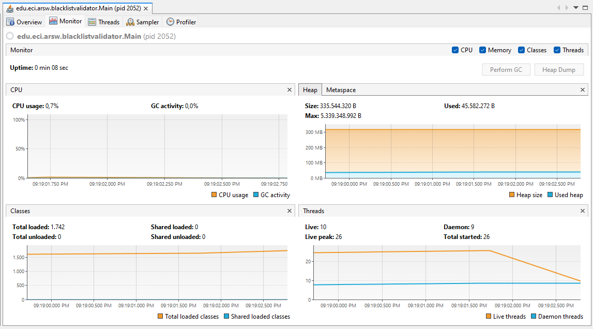
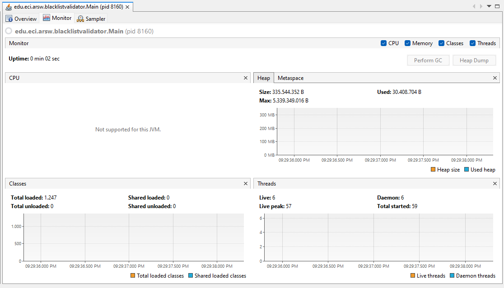
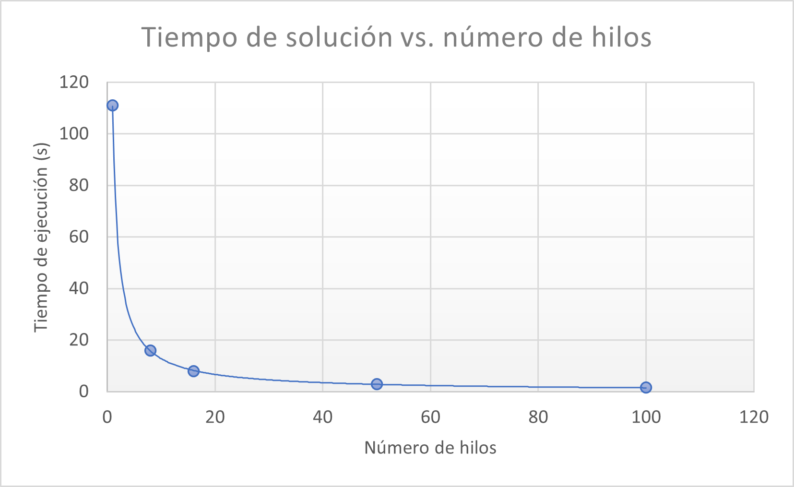

### Escuela Colombiana de Ingeniería - Arquitecturas de Software - ARSW
## Ejercicio Introducción al paralelismo - Hilos - Caso BlackListSearch
#### Integrantes : Angie Natalia Mojica - Daniel Antonio Santanilla

### **Parte I - Introducción a Hilos en Java**

2.4. ¿Cómo cambia la salida con '.start()' y '.run()'? 

- Al ejecutar el método start() los números aparecen de forma aleatoria esto debido a que los hilos estan funcionando como "condición de carrera" o lo que es competir por el procesador. Por otro lado, con el método run() los números salen en orden y esto es porque los hilos se ejecutan de forma secuencial, se ejecuta un proceso a la vez.

### **Parte II.I Para discutir la próxima clase**

¿Cómo se podría modificar la implementación para minimizar el número de consultas en estos casos? ¿qué elemento nuevo traería esto al problema?

- En subprocesos múltiples, la entidad compartida, en este caso el contador, conduce principalmente a un problema cuando se incorpora la concurrencia pues es data no actualizada. Para ello una posible solución es una variable atómica.

### **Parte III - Evaluación de Desempeño**

1. Un solo hilo.

2. Tantos hilos como núcleos de procesamiento: el número de núcleos es 8 en este caso.

3. Tantos hilos como el doble de núcleos de procesamiento: 16 núcleos.

4. 50 hilos.

5. 100 hilos.

    Con lo anterior, y con los tiempos de ejecución dados, se hace una gráfica de tiempo de solución vs. número de hilos.

    

    En la gráfica se observa que entre mayor es el número de hilos, menor es el tiempo de ejecución. Pero llega a un punto donde tener más hilos no marca considerablemente la diferencia en tiempo de ejecución.

### **Parte IV - Ejercicio Black List Search**

1. Según la [ley de Amdahls](https://www.pugetsystems.com/labs/articles/Estimating-CPU-Performance-using-Amdahls-Law-619/#WhatisAmdahlsLaw?):

	, 
  
    Donde _S(n)_ es el mejoramiento teórico del desempeño, _P_ la fracción paralelizable del algoritmo, y _n_ el número de hilos, a mayor _n_, mayor debería ser dicha mejora. 
    
    ¿Por qué el mejor desempeño no se logra con los 500 hilos? ¿Cómo se compara este desempeño cuando se usan 200?

    Suponiendo que la fracción paralelizable es del 60%, se tiene que _S(200) = 2.4813_ y  _S(500) = 2.4925 _ y cada vez que _n_ es más grande, la mejora del desempeño teorica tiende a _2.5_. Con lo anterior, se puede concluir que entre más hilos, menor es el rendimiento teórico.

2. ¿Cómo se comporta la solución usando tantos hilos de procesamiento como núcleos comparado con el resultado de usar el doble de éste?.

    Al usar tantos hilos como el doble de núcleos es mejor que usar la misma cantidad de hilos como núcleos, pues se reduce a la mitad el tiempo de ejecución cuando los hilos son el doble de núcleos.

3. De acuerdo con lo anterior, si para este problema en lugar de 100 hilos en una sola CPU se pudiera usar 1 hilo en cada una de 100 máquinas hipotéticas, la ley de Amdahls se aplicaría mejor?. Si en lugar de esto se usaran c hilos en 100/c máquinas distribuidas (siendo c es el número de núcleos de dichas máquinas), se mejoraría?. Explique su respuesta.
    - **100 Máquinas 1 hilo en cada una**: Puede que haya una mejoría, pues se está aprovechando al máximo los recursos en cada una de las máquinas hipóteticas.
    - **c hilos en 100/c máquinas**: Cada hilo tiene los recursos suficientes para aprovechar al máximo el rendimiento en las 100 máquinas. Se mejoraría el rendimiento ya que muchas partes se pueden hacer al mismo tiempo.
